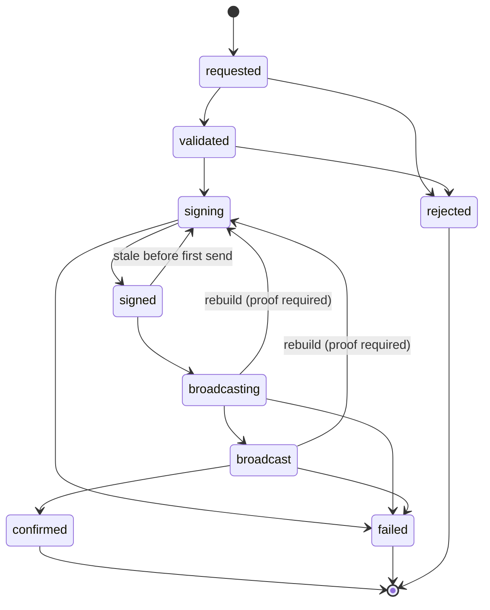

# sluice

[](https://github.com/Adunka/withdrawal-processor/actions/workflows/ci.yml)

An idempotent TRC-20 (USDT on TRON) withdrawal processor that guarantees a
withdrawal is **never created, signed, or broadcast twice** — not when two
workers race for the same operation, not when a process dies mid-broadcast,
and not when the node accepts a transaction and *then* times out.

Signing is mocked (deterministic HMAC); the TRON node is mocked with fault
injection. Everything else — the state machine, the claim protocol, the
recovery logic, the database schema — is built the way I would build it for
real money, because that discipline is the point of the exercise.

```
$ make test     # the whole failure matrix, zero dependencies, ~0.5s
$ make demo     # watch a crash + a lying timeout resolve into exactly one payment
```

## The thesis

> **The database can lie. The chain cannot.**
>
> Local state goes stale, leases expire while their holders still believe in
> them, and a crash can separate "we sent it" from "we recorded that we sent
> it". So idempotency is anchored where no process can corrupt it: in the
> transaction id itself. On TRON, `txid = sha256(raw_data)` — it is fully
> determined *before* broadcast, the network deduplicates on it, and the
> signature is not part of it. Recovery therefore never guesses from memory;
> it asks the chain about a txid it already knows.

That last property (signature excluded from txid) is a genuine gift of
TRON's transaction format: even a non-deterministic production signer (HSM
with a random ECDSA nonce) cannot change the txid, so re-signing after an
ambiguous failure is still safe. On Ethereum, where the hash covers the
signature, this design would need an extra layer.

## The state machine



The transition table lives in `sluice/states.py` and is mirrored by a
database trigger in `migrations/001_schema.sql`: an illegal transition or
any write to a terminal row is rejected *by Postgres*, even from a raw psql
session. Two alarms guard the duplication: the fast tier *parses the
migration* and diffs the trigger's pair list against the Python table on
every `make test`, and the pg tier walks the full matrix against a live
trigger. The copies cannot drift silently.

Every transition is one atomic write, and the event log row commits in the
same transaction — the audit trail cannot disagree with the state it
audits.

## Three gates against double-spending

**Gate 1 — intake.** The client mints the `operation_id` (UUID, primary
key). `INSERT … ON CONFLICT DO NOTHING` makes concurrent identical POSTs
collapse into one row; a request hash over the canonical payload
distinguishes an honest retry (`200` + `X-Idempotent-Replay: true`) from a
client bug reusing an id for a different payload (`409`, refused). Amounts
are decimal strings parsed exactly into integer base units — a JSON float
is a `422`, full stop.

**Gate 2 — single writer.** Workers claim batches with
`FOR UPDATE SKIP LOCKED` (contenders skip, never queue) and hold a *lease*,
not a lock — a dead worker's operations become claimable again by
themselves. Because leases expire while their holders may still be running
(GC pause, network partition), every claim also increments a **fencing
token**, and every subsequent write is a compare-and-swap on
`(id, token, state)`. A zombie's write matches zero rows; the moment a CAS
returns nothing, the worker stops mid-sentence. The mock node logs which
worker touched the wire, and the zombie test checks that log: the fenced
worker never reaches the network at all.

**Gate 3 — the chain.** The txid is computed and durably stored *before*
signing, and the state `broadcasting` is committed *before* the network
call (write-ahead intent). Whatever happens next — crash, timeout, node
restart — recovery holds a txid and asks the chain a three-valued question:
included (advance), pending (advance), or unknown (see the theorem below).

## Recovery is not a mode

There is no reaper, no repair script, no startup scan. A crashed worker's
operation simply becomes claimable when its lease expires, and the handler
for each state doubles as its own recovery procedure — a reclaimed
operation is indistinguishable from a fresh one *on purpose*. The entire
reconciliation logic for the scariest state is one decision table:

```
state = broadcasting, i.e. "someone committed to sending txid T"

  chain says INCLUDED  -> advance (money moved, exactly once)
  chain says PENDING   -> advance (accepted, waiting for a block)
  chain says UNKNOWN   -> two worlds, split by CHAIN time:
      solid_time <  expiration + margin : T may still be in flight.
          Re-send the SAME bytes (same txid, network dedups) and wait.
          Re-signing or rebuilding here is forbidden.
      solid_time >= expiration + margin : T is provably dead ->
          retire it, build a fresh envelope (new txid), attempt += 1.
```

## The rebuild theorem

Rebuilding is the only dangerous operation in the system: a new envelope
means a new txid, and if the old transaction were still alive somewhere,
both could land. So a rebuild requires proof of death, and the proof is a
protocol argument, not a heuristic:

1. A block cannot include a transaction whose `expiration` precedes the
   block's timestamp (network validity rule; the mock node enforces it).
2. Block timestamps rise strictly with height.
3. Solid (finalized) blocks are irreversible.

Therefore, once the **timestamp of the latest solid block** — fetched from
the node, never our wall clock, which drifts and lies — exceeds
`expiration + safety_margin`, and the node does not know the txid: every
past block has been checked and every future block is timestamped past the
deadline. The old txid has nowhere left to land. ∎

Two tempting shortcuts are explicitly banned and covered by tests: rebuild
on wall-clock expiry, and rebuild because the node *answered* with an
expiration error (nodes are taken at their word about acceptance, never
about death — the tx could have been accepted by an earlier attempt and be
sitting in a mempool). Each rebuild files its `expiry_evidence` (solid
chain time, expiration, lookup result) into the event log, so the decision
can be re-audited against the chain after the fact.

## Failure scenarios handled

Every row is a test you can run; none of them sleep or poll wall time.

| Scenario | What the system does | Test |
|---|---|---|
| Client retries a timed-out POST | Same row, `200` + replay header | `test_intake.test_created_then_replayed` |
| 32 concurrent identical POSTs | Exactly one row created | `test_intake.test_32_concurrent_identical_posts_one_row` |
| Same id, different payload | `409`, original untouched | `test_intake.test_same_id_different_payload_is_a_409` |
| Two workers, one operation | One claims, other gets nothing, no blocking | `test_fencing.test_two_workers_one_operation_…` |
| Worker crashes after write-ahead, before send | Recovery re-sends the same bytes; one accept total | `test_crash_recovery.test_crash_after_write_ahead_before_send` |
| Worker crashes after send, before recording | Recovery finds txid on chain, carries on; no second spend | `test_crash_recovery.test_crash_after_send_before_recording_result` |
| Node accepts tx, then times out | Reconcile finds it pending; no rebuild, no re-sign | `test_crash_recovery.test_timeout_that_was_secretly_an_accept` |
| Node times out having dropped the tx | Same bytes re-sent; dedup makes it safe | `test_crash_recovery.test_timeout_that_really_was_a_drop` |
| Tx expires while all workers are dead | Rebuild with new txid, only after chain-time proof | `test_crash_recovery.test_dropped_tx_worker_dead_past_expiration_…` |
| Node accepts tx, mempool drops it | `broadcast` state waits out expiration, then rebuilds | `test_crash_recovery.test_accepted_but_never_mined_…` |
| Node answers with an unknown code | Treated as ambiguous; reconcile resolves; no rebuild | `test_crash_recovery.test_unknown_broadcast_code_…` |
| Node *claims* the tx expired | Not taken at its word; rebuild still waits for chain-time proof | `test_crash_recovery.test_nodes_word_is_not_proof` |
| Transaction reverts on chain | `failed`, terminal, immutable; no funds moved | `test_lifecycle.test_reverted_on_chain_is_failed_not_confirmed` |
| Zombie worker with expired lease wakes up | Every write fenced to zero rows; node log clean | `test_fencing.test_zombie_write_lands_on_nothing` |
| All of the above at once, ×60, on 6 threads | Six named invariants verified against DB *and* chain | `test_chaos` |

The chaos test deserves a sentence: it runs sixty withdrawals through six
worker threads while crash points fire, the network lies on a seeded
schedule, and duplicates arrive concurrently — then verifies liveness,
"≤ 1 on-chain tx per operation", conservation of money (chain total equals
confirmed total, to the unit), intake uniqueness, audit-log legality, and
that every rebuild carried evidence.

## Two test tiers

- **Fast tier** (`make test`) — pure stdlib `unittest`, in-memory store,
  fake clock, runs anywhere Python 3.11+ exists in about half a second.
  (The handful of HTTP-layer tests need flask - the app's own runtime
  dependency - and skip themselves on a truly bare interpreter.)
  This is where the whole failure matrix lives, because determinism is what
  makes crash tests trustworthy: time moves only when a test says so.
- **Postgres tier** (`make db-up && make test-pg`) — proves what the fast
  tier outsources to the database: real `SKIP LOCKED` exclusivity under
  concurrent connections, the transition trigger (full matrix, both
  directions), `ON CONFLICT` intake races, fencing enforced by raw SQL, and
  `NUMERIC(38,0)` round-tripping 10³⁰ exactly.

The in-memory store implements the same `Store` protocol with the same
claim/CAS/fencing semantics, so the pipeline cannot tell the difference —
which is precisely what makes the fast tier honest.

## Design decisions & trade-offs

**Postgres as the queue, nothing else.** `FOR UPDATE SKIP LOCKED` plus a
state column *is* a job queue, and it participates in the same transactions
as the state machine — which is the entire trick. A broker (Kafka, Celery,
Redis) would add a second source of truth and hide exactly the transitions
this project exists to make explicit. Polling with jitter instead of
LISTEN/NOTIFY for the same reason: fewer moving parts, and worker latency
is not the bottleneck of a withdrawal pipeline — confirmation time is.

**Leases + fencing instead of held locks.** Holding a row lock for the
whole lifecycle would pin a connection per in-flight withdrawal and turn
worker death into lock limbo. Short claim transactions with expiring leases
survive crashes by construction; fencing tokens close the zombie window the
leases open. Every CAS also renews the lease, so there's no separate
heartbeat machinery to get wrong.

**Semantic request hash.** The hash covers the *normalized* payload
(`"1.5"` and `"1.50"` are the same instruction), not raw bytes — retries
through client libraries that re-serialize JSON shouldn't produce spurious
409s. Trade-off: a client sending a genuinely different byte-stream that
normalizes identically gets a replay rather than an error. For money, the
semantic reading is the right one.

**The transition table exists twice** — Python and SQL trigger — which is a
deliberate duplication: the application gets stack traces for programming
errors, the database stops everyone else (including humans with psql). The
pg tier's matrix-walk test is the drift alarm.

**One live envelope per operation, by schema.** The current envelope lives
on the operation row; retired txids live in the append-only event log; a
partial unique index guarantees a txid belongs to one operation forever.
An alternative design with a separate `attempts` table and a
"one live attempt" partial index expresses the same invariant with more
ceremony; I chose the smaller schema and let the event log carry history.

**Mock realism has a boundary.** The mock keeps the properties the
guarantees rest on — txid determinism, dedup by txid, strict block-time
monotonicity, the expiration validity rule, solidity lag, and the ability
to accept-then-timeout — and drops what they don't: real protobuf
serialization, bandwidth/energy accounting, TAPoS reference validation.
Each dropped item is a production concern, not an architectural one; the
canonical-JSON serialization swaps for protobuf without touching a single
transition.

**The signer is a `sign(tx) -> signature` boundary.** Swapping the HMAC
mock for a KMS/HSM changes one class. The one real consequence is noted in
the pipeline: with a *remote* signer, "timed out while signing" becomes an
ambiguous failure like broadcast, and the signing stage must grow the same
query-before-retry shape — the state machine already leaves room for it.

## Non-goals

Real key management, balance/liquidity accounting, fee (energy/bandwidth)
management, compliance checks, authentication, rate limiting, an admin UI,
and performance work beyond batch claims and partial indexes. Every one of
these belongs in a production system and none of them change the answer to
"why can't this double-spend?".

## Quick start

```bash
# fast tier: no database, no third-party packages
make test

# narrative demo (crash + lying timeout + duplicate, resolved on stdout)
make demo

# Postgres tier
make db-up          # docker compose; applies migrations on first boot
make test-pg
make db-down

# poke the API by hand (in-memory store, no worker)
make api
curl -s localhost:8080/v1/withdrawals -X POST -H 'content-type: application/json' \
  -d '{"operation_id":"11111111-1111-4111-8111-111111111111",
       "to_address":"TR7NHqjeKQxGTCi8q8ZY4pL8otSzgjLj6t",
       "amount":"12.50","asset":"USDT-TRC20"}'
```

## Layout

```
sluice/
├── api.py              # Flask intake: 201 / 200-replay / 409 / 422
├── service.py          # validation + idempotent insert
├── states.py           # the transition table (single source of truth)
├── pipeline.py         # per-state handlers == recovery procedures
├── worker.py           # claim loop; deliberately boring
├── crashpoints.py      # scripted kill -9 (BaseException, flies past `except Exception`)
├── canonical.py        # request hashing
├── money.py            # exact decimal-string -> base-units parsing
├── store/
│   ├── memory.py       # fast tier: same claim/CAS/fencing semantics
│   └── postgres.py     # SKIP LOCKED claims, fenced CAS + event in one tx
└── tron/
    ├── address.py      # real base58check (validates the actual USDT contract)
    ├── types.py        # broadcast-code taxonomy, txid computation
    ├── signer.py       # deterministic HMAC mock behind a signer boundary
    └── mocknet.py      # a TRON that lies on schedule
migrations/001_schema.sql   # enum, NUMERIC(38,0), trigger guard, event log
tests/                      # fast tier (stdlib only)
tests/pg/                   # Postgres tier (needs DATABASE_URL)
scripts/demo.py             # the ninety-second story
```
